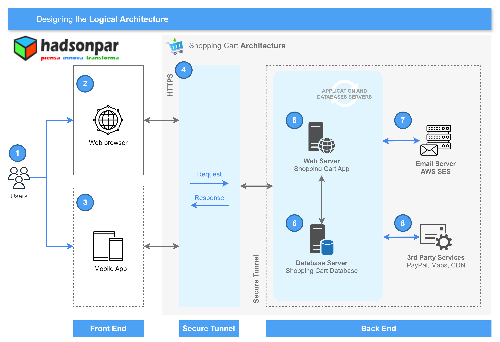

# Shopping Cart PHP and MySQL

## Here the links about out tutorials developer Shopping Cart in PHP and MySQL
1. Resource part one
    - [Blog post](http://blog.hadsonpar.com/2023/02/requisitos-necesarios-para-trabajar-con.html)
    - [Directories](/01-ShoppingCart) base project
2. Resource part two
    - [Blog post](http://blog.hadsonpar.com/2024/04/arquitectura-logica-para-construcion-de.html)
    - [Directories](/02-ShoppingCart) base project
    - Logical Architecture Design:
    
    - Components of Logical Architecture:
    1. Users: Logical component that intervenes is our logical architecture, that is, a user or several users can interact with the shopping cart taking into account interfaces such as the Web browser and Mobile App (finally both are components that intervene that intervene in the architecture) .
    2. Web browser: Component or interface that is part of our architecture, a component that will allow the user to interact with the shopping cart.
    3. Mobile App: Mobile application designed to run the shopping cart on a mobile device (the shopping cart will only run in the web browser - responsive web).
    4. Https: Secure hypertext transfer protocol for sending data between the web browser and the shopping cart. HTTPS is encrypted to increase the security of data transfers.
    5. Web Server: Web server to process the web application (Shopping Cart) on the server side, with the purpose of making bidirectional or unidirectional and synchronous or asynchronous connections on the client interface side (requests).
    6. Database Server: Database server that provides the Shopping Cart database. Likewise, it provides us with database administration environments.
    7. Email Server: Mail server to transfer and deliver email messages between customers' emails when they make the payment process.
    8. 3rd Party Services: Third party services such as PayPal to make online payments, Maps to locate physical stores or other addresses, CDN for Bootstrap distribution and others.